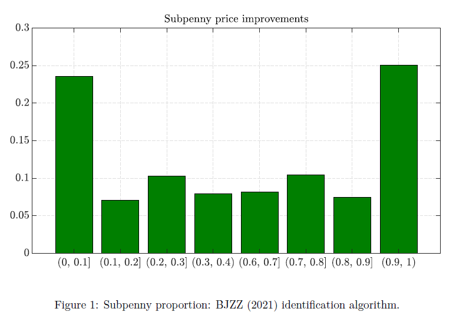
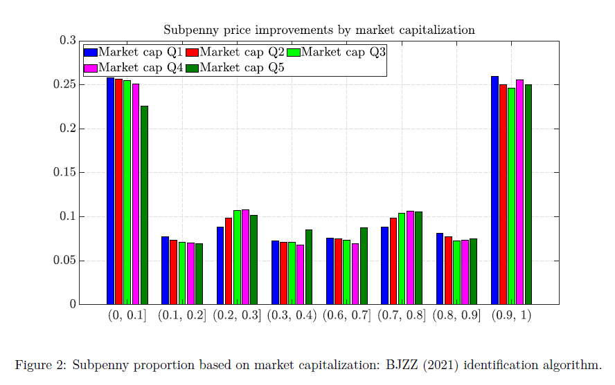
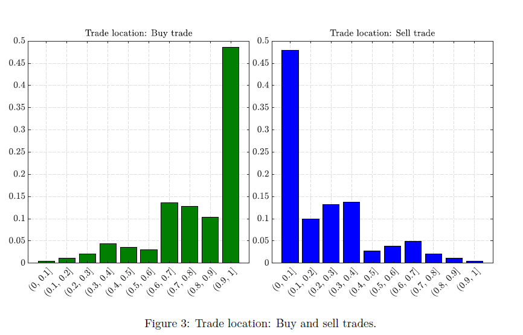
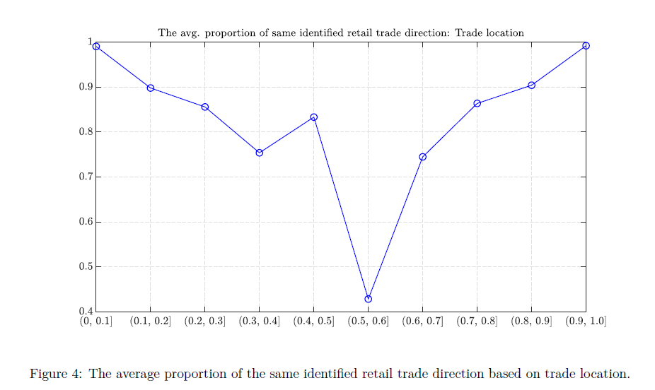

# Retail trades in the U.S. stock markets
## Introduction

Today, it is easier for retail traders to buy and sell stocks than decades ago due to improvements in financial technology. First, retail traders can enjoy more and cheaper stock data, which makes their investments more reasonable. Second, some brokers and dealers promote their zero-commission fee plan for retail traders. Third, retail traders do not necessarily need to trade a whole share, however, they can trade fractional shares, and can also trade in dollars. For example, you do not need to buy a share of Apple Inc. stock, you can buy $10 or 0.05 shares of it. It is more easier for retail traders to access the stock markets and the academics call this the democratization of stock markets.

One of the broker-dealers that provides specific services for retail traders is Robinhood. Robinhood was almost the first one to promote zero-commission fee for stock trading with a very user-friendly interface. This means that traders no longer completely rely on complex figures or technical indicators to buy and sell stocks, and they can check some recommended list of stocks or public analyst ratings to do the trading. Robinhood has witnessed a surge of new users during the covid-19 pandemic when people were required to stay home. Generally, retail traders are likely to use market orders to get immediate purchase than other order types. However, retail traders’ market orders are not sent to exchanges. Their orders are internalized and executed with a wholesaler that has a contract with the Robinhood. Thus, we cannot not directly identify retail trades if the Robinhood does not disclose their proprietary data.

Fortunately, some literature Boehmer et al. (2021) proposes a method to identify retail trades through public data. They suggest that the internalization generally rebate the retail trades by a sub-penny amount, e.g., $0.002 compare to the prevailing National Best Bid and Offer (NBBO) when this trade is initiated. Thus, if we find there are trades with sub-penny price, it could be a retail trade. However, a subpenny trade might not exactly be a retail trade as those that are from dark pools can be executed at the midpoint price. However, the BJZZ algorithm is not able to further distinguish these. Hence, it is likely to provide a lower bound of retail trades.

Furthermore, one may also want to know the trading direction of retail trades, i.e., buyer-initiated trades or sell-initiated trades. Typically, the trading direction can be identified by the Lee and Ready (1991) if trades occur from exchanges. However, since retail trades are not executed from the exchange, thus, the BJZZ identify the trading direction based on the subpenny amount. Recently, Barber et al. (2024) test the accuracy of BJZZ identification with a simple and commonly used method, and also propose a quoted spread midpoints method to identify.

In this project, first, I intend to understand the characteristics of retail trades, such as trade size, trade price, trading volume, etc. More importantly, we are interested in knowing the distribution of sub-penny rebate amounts. Do most retail traders receive substantial amount of rebates? Or are the rebates generally of a low amount? Furthermore, I also intend to figure out whether there are any differences between odd lots (trades less than 100 shares) and round lots (trades at least 100 shares).

Second, I want to know the proportion of retail trades of a stock and whether it is related to the firm’s market capitalization. This could briefly tell us whether retail trades are more likely to trade large-cap stocks.

Third, I intend to figure out whether BJZZ identification method performs well compared to other methods?

In traditional financial view, retail traders do not have information advantage compared to institutional traders, and their trades are not viewed as informed. Thus, the retail traders are not put in the center of finance literature. However, because of the democratization of financial industry, it is much easier for them to get exposures in the equity market. Thus, retail trades have received more attention than before. However, since retail trades are not professional about the stock market itself as well as some general business practice in the industry, they are more likely to face more challenges than some other professional traders.

One of the most challenging regulatory concerns is the execution quality of retail trades. For example, retail traders might not receive the best price when their orders are about to get executed. Specifically, their buy (sell) orders might be executed at a higher (lower) price than at which they are supposed to be. Thus, identifying retail trades through the public data is helpful for us to know the execution quality of retail trades.

# Background
Generally, retail trades are hard to identify through the non-regulatory data (e.g., TAQ data) as one does not know the account-level information. The account-level data are generally hard to get from brokers and dealers. However, retail trades are likely to evolve fast especially during the high-frequency trading era. Retail traders face less capital constraint as more brokers and dealers do not charge commission fees and provide various order types for retail traders to better manage their trading strategies and inventories. Hence, identifying retail trades and know their trading patterns is important.

Another relevant concept is odd lot trades. Generally, trades for fewer than 100 shares of stock are defined as odd lot trades. Traditionally, odd-lot trades and volumes are marginal and were believed to originate from retail traders and little informative. TAQ data do not include the odd-lot trades before end 2013. It is reasonable to argue that most retail trades are odd-lot trades but not vice versa. O’Hara, Yao, and Ye (2014) suggest that odd-lot trades could be primarily driven by order split by high-frequency traders to reduce price impacts. Hence, simply identifying the retail trades as odd-lot trades are not reasonable.

As I mentioned before, retail trades are not sent to the exchanges and executed there. They are likely to be routed to wholesalers and get executed with subpenny price improvements. All these off-exchange trading activities will be recorded to the TRFs. This could be a potential and better way to identify retail trades compared to the odd-lot trades. Based on this, Boehmer et al. (2021) identify the retail trades in the U.S. stock markets and provide a series of summary statistics, including trading volume, number of trades, order imbalance. They also further investigate the odd lots within the retail trades. The time-series plot of order imbalance shows that no significant pattern can be found over time.

The key assumption of Boehmer et al. (2021) identification is retail trades executed off-exchange should have subpenny price improvements. Boehmer et al. (2021) stated that their methodology has little discriminatory power between dark pool trades that usually occur at mipoint price (i.e., half penny) and retail trades whose subpenny price improvement is extremely near half penny. Recently, some studies assess the accuracy of Boehmer et al. (2021) identification algorithm by using proprietary data. For instance, Battalio et al. (2022) investigate the accuracy of Boehmer et al. (2021) and they suggest this method identifies less than one-third of these trades generally assumed to be from retail trades. Their proprietary data shows institutional trades can also occur at non-midpoint subpenny prices, which violates the Boehmer et al. (2021)’s key assumption. Barber et al. (2024) used six retail brokerage account-level data to identify and sign retail trades. The Boehmer et al. (2021)’s algorithm identifies 38% of trades as retail, of which 28% are incorrectly signed. They also propose a new method to sign retail trades using quoted spread midpoints. Obviously, Boehmer et al. (2021)’s identification does not perform perfectly if one does not have proprietary data. However, this methodology could be a useful reference in future microstructure research.

It is worth noting that it is hard to get the ``real’’ benchmark data for the retail trades in the U.S. stock market and all of the identification methods used here are just inference. Thus, all analyses here do not suggest how exactly these identification methods can accurately measure the retail trades in the real-world scenario.

# Data
I use the daily millisecond Trade and Quote (TAQ) data to identify retail trades in the U.S. stock markets. The daily consolidated trade files record all trades occur in all trading venues for all stocks. Since retail trades occur off-exchange, so our major data is obtained from the subset with exchange code `D.’ My sample period spans from August 3, 2015 to December 31, 2017. We focus on common stocks with the CRSP share codes 10 and 11 with primary listing exchanges NYSE and NASDAQ. We exclude stocks that not experience merge, acquisition, delisting, or split (DISTCD starts with 5). We also require stocks that cannot change primary exchange, ticker symbol, or CUSIP code during the sample period. To ensure our results are not confounded by the tick size, we delete stocks with closing price greater than zero and daily low price is greater than $1. Finally, we exclude stocks whose round lot is not 100 shares, though most stocks have round lots of 100 shares. For intraday analysis, we make sure that all sample stocks have trading activities in the TAQ data. We obtain 797,181 stock-day observations, comprising 1,311 stocks.

One should note that there is a structural change happens in our second subsample. The U.S. Securities and Exchange Commission (SEC) initiated a tick size pilot program in 2016. The tick size pilot generally increases tick size for stocks with low liquidity from $0.01 to $0.05. This would affect the Boehmer et al. (2021)’s algorithm as the general subpenny assumption might be violated for these stocks. Hence, I remove stocks included in the test groups G2 and G3 for the tick size pilot program, as suggested by Barber et al. (2024).

The TAQ data are extracted from Wharton Research Data Service (WRDS) subscribed by the University of Illinois at Urbana-Champaign. I write a SQL query to extract the data and store them in a daily basis. Some high-performance computing nodes supported by the Illinois Campus Cluster funded by the College of Agricultural, Consumer, and Environment Sciences are used here for analyzing the data. Actually, it is hard to use a personal computer to process the data.

# Retail trades identification methodologies
As what we discussed before, we need to obtain subpenny price improvements of each trade executed off-exchange. Boehmer et al. (2021) propose an algorithm to calculate the supenny price improvements. Please see details in Boehmer et al. (2021).

Alternatively, Barber et al. (2024) measure the accuracy of the BJZZ (2021) algorithm. They compare the BJZZ (2021) algorithm with the Lee and Ready (1991) midquote assigning method. Specifically, they assign a trade as a buy (sell) if the execution price is greater (less) than the midpoint quote. However, they do not assign trades that execute between 40% and 60% of the National Best Bid or Offer (NBBO).

# Empirical results
## BJZZ (2021) identification algorithm
I first show the summary statistics of the sampled stocks in Table 1 for closing price in USD (Panel A), dollar trading volume (million USD, Panel B), and market capitalization (million USD, Panel C). I find that the average stock price is around $54.71 and the maximum stock price is over $2,000. For dollar trading volume, on average, the stocks witness $100 million trading volume, with the maximum trading volume over $18,237 million. In terms of the market capitalization, I find it is lower than the dollar trading volume, resulting in higher turnover rates. All indicators are also summarized according to the quintile of stock’s capitalization.

| Panel | Group         | Mean   | Std    | Min  | P25    | Med    | P75    | Max      | N       |
| ----- | ------------- | ------ | ------ | ---- | ------ | ------ | ------ | -------- | ------- |
| A     | All           | 54.71  | 78.61  | 1.00 | 16.56  | 36.65  | 68.50  | 2049.00  | 797,181 |
| A     | Market cap Q1 | 12.93  | 11.58  | 1.00 | 4.60   | 9.44   | 17.56  | 100.05   | 159,558 |
| A     | Market cap Q2 | 31.82  | 37.14  | 1.23 | 14.02  | 23.87  | 39.85  | 689.35   | 159,558 |
| A     | Market cap Q3 | 52.09  | 52.43  | 1.59 | 23.72  | 41.74  | 65.64  | 762.27   | 158,949 |
| A     | Market cap Q4 | 75.15  | 67.76  | 1.43 | 35.45  | 56.91  | 91.24  | 757.77   | 159,558 |
| A     | Market cap Q5 | 101.54 | 130.94 | 2.45 | 47.90  | 74.59  | 115.34 | 2049.00  | 159,558 |
| B     | All           | 100.43 | 274.63 | 0.00 | 6.03   | 29.11  | 94.33  | 18237.56 | 797,181 |
| B     | Market cap Q1 | 2.87   | 7.41   | 0.00 | 0.34   | 1.08   | 3.00   | 1034.98  | 159,558 |
| B     | Market cap Q2 | 17.34  | 27.64  | 0.17 | 4.69   | 9.63   | 19.65  | 1294.06  | 159,558 |
| B     | Market cap Q3 | 40.51  | 50.89  | 0.40 | 16.80  | 28.31  | 47.79  | 2304.03  | 158,949 |
| B     | Market cap Q4 | 84.02  | 92.96  | 0.95 | 38.95  | 63.25  | 100.96 | 3485.04  | 159,558 |
| B     | Market cap Q5 | 357.20 | 527.81 | 9.04 | 131.55 | 213.27 | 381.11 | 18237.56 | 159,558 |
| C     | All           | 14.76  | 42.35  | 0.01 | 0.87   | 3.47   | 10.05  | 904.87   | 797,181 |
| C     | Market cap Q1 | 0.29   | 0.20   | 0.01 | 0.13   | 0.26   | 0.41   | 2.65     | 159,558 |
| C     | Market cap Q2 | 1.33   | 0.61   | 0.19 | 0.86   | 1.22   | 1.69   | 7.07     | 159,558 |
| C     | Market cap Q3 | 3.57   | 1.10   | 0.48 | 2.76   | 3.49   | 4.26   | 11.05    | 158,949 |
| C     | Market cap Q4 | 8.29   | 2.83   | 0.86 | 6.12   | 7.87   | 10.09  | 23.60    | 159,558 |
| C     | Market cap Q5 | 60.27  | 79.52  | 5.98 | 19.90  | 31.18  | 61.62  | 904.87   | 159,558 |

Next, I report the summary statistics of identified retail trades by BJZZ (2021) algorithm in Table 2. Like what I mentioned before, the BJZZ algorithm relies on the range of subpenny of trades to identify whether a trade is initiated by retail traders. Panel A of Table 2 shows both the round-lot and odd-lot retail trades. The round lot here is defined as trades that are greater than 100 shares. We find that for all stock-day observations, the average share volume is around 152 thousand and the average dollar trading volume is around 7 million dollars. However, one should note that the number of retail trades are not very large. In our sample, we find the average number of trades is around 510, which means that a single 
retail trade might be a large size. Moreover, the standard deviation of retail trades is very high, which may imply that retail traders might highly focus on some specific popular stocks.

| Panel | Metric                           | Mean   | Std    | P25    | Med   | P75   | N       |
| ----- | -------------------------------- | ------ | ------ | ------ | ----- | ----- | ------- |
| A     | Share volume (× 1,000)           | 152.15 | 632.12 | 7.71   | 28.82 | 94.97 | 791,464 |
| A     | Number of trades                 | 510    | 1340   | 52     | 184   | 459   | 791,464 |
| A     | Dollar volume (million)          | 6.98   | 36.57  | 0.20   | 1.06  | 3.84  | 791,464 |
| A     | Order imbalance (Share vol., %)  | −0.50  | 33.18  | −16.71 | −0.02 | 15.69 | 791,464 |
| A     | Order imbalance (Ntrd, %)        | −0.55  | 26.11  | −12.14 | 0.00  | 11.11 | 791,464 |
| A     | Order imbalance (Dollar vol., %) | −0.48  | 33.18  | −16.70 | −0.02 | 15.71 | 791,464 |
| B     | Share volume (× 1,000)           | 5.78   | 16.10  | 0.47   | 1.68  | 4.69  | 791,464 |
| B     | Number of trades                 | 220    | 602    | 17     | 65    | 180   | 791,464 |
| B     | Dollar volume (million)          | 0.55   | 3.31   | 0.01   | 0.06  | 0.29  | 791,464 |
| B     | Order imbalance (Share vol., %)  | −0.52  | 39.93  | −18.39 | 0.38  | 17.41 | 791,464 |
| B     | Order imbalance (Ntrd, %)        | −1.59  | 35.54  | −16.98 | 0.00  | 13.51 | 791,464 |
| B     | Order imbalance (Dollar vol., %) | −0.50  | 39.93  | −18.37 | 0.40  | 17.43 | 791,464 |

I also focus on the order imbalance of retail trades. The order imbalance measures the price pressure, which focuses on the difference between the buyer-initiated trades and seller-initiated trades. I try different indicators, including the share volume, number of trades, the dollar trading volume. Consistent to Boehmer et al. (2021), I find the average order imbalance is around 0, which indicates that there is no such a huge difference between buyer-initiated trades and seller-initiated trades. The three indicators also yield a qualitatively similar result.

Panel B of Table 2 reports the results for the odd-lot only. Again, the odd-lot is defined as a trade that is less than 100 shares. I find the odd-lot share volume is more than 5,000 and the number of trades is almost as half as that for all trades. Obviously, the dollar trading volume for odd-lot retail trades is substantially lower than that for round-lot retail trades. Consistent to my all-lot trades presented in Panel A, we find that the average order imbalances are still around 0, and their magnitudes are slightly higher than those reported in Panel A.

I also summarize the results according to the market capitalization and they are reported in Table 3 where Panel A shows the number of trades and Panel B shoes the dollar trading volume. Consistent to my expectation, more retail trades are likely to occur for large-cap stocks, from 82 for the lowest-cap to 1,597 for the largest-cap, on average. Panel B also shows the similar pattern. The average dollar trading volume for the lowest-cap stocks is 0.26 million while this number of the largest-cap stocks is 27.11 million. My results reveal that retail traders are likely to trade large-cap stocks instead of low-cap stocks.

| Panel | Statistic                           | Market Cap Q1 | Market Cap Q2 | Market Cap Q3 | Market Cap Q4 | Market Cap Q5 |
| ----- | ----------------------------------- | ------------- | ------------- | ------------- | ------------- | ------------- |
| A     | **Number of Trades**                |               |               |               |               |               |
|       | Mean                                | 82            | 187           | 273           | 395           | 1597          |
|       | Std                                 | 269           | 451           | 595           | 784           | 2476          |
|       | P25                                 | 8             | 22            | 85            | 172           | 516           |
|       | Median                              | 22            | 66            | 153           | 269           | 892           |
|       | P75                                 | 68            | 191           | 274           | 421           | 1707          |
|       | N                                   | 154,464       | 158,938       | 158,946       | 159,558       | 159,558       |
| B     | **Dollar Trading Volume (Million)** |               |               |               |               |               |
|       | Mean                                | 0.26          | 1.10          | 2.16          | 3.99          | 27.11         |
|       | Std                                 | 1.02          | 3.61          | 6.69          | 11.01         | 77.05         |
|       | P25                                 | 0.02          | 0.09          | 0.46          | 1.18          | 4.97          |
|       | Median                              | 0.05          | 0.29          | 0.91          | 2.08          | 9.87          |
|       | P75                                 | 0.18          | 0.86          | 1.83          | 3.79          | 22.45         |
|       | N                                   | 154,464       | 158,938       | 158,946       | 159,558       | 159,558       |

Since the retail traders are supposed to receive the subpenny price improvements if their market orders are not sent to the exchange, readers may like to know the distribution of subpenny portions of the retail trades. I summarize the results in Figure 1 and my results are consistent to Boehmer et al. (2021). It is obvious that retail traders are more likely to receive subpenny price improvements that are either within (0,0.1] or (0.9,1) than some other subpenny ranges. Furthermore, we find that the buyer-initiated trades (with subpenny within in $(0.6, 1)$) are liekly to receive a relatively higher subpeeny price improvements and similar logic can be applied for seller-initiated trades (with subpenny within (0, 0.1]) as well.

## Subpenny proportion: BJZZ (2021) identification algorithm
One may believe that the subpenny proportion might be related to the market capitalization. Thus, I also summarize my subpenny results based on the market capitalization. The result is shown in Figure 2. It is obvious that the distribution of subpenny groups is consistent for all stocks with different market capitalization. More importantly, we find that this subpenny price improvements are not likely to be proportional to the stock price. Specifically, I expect that the subpenny price improvements become lower for high-priced stocks compared to low-priced stocks.

Subpenny proportion based on market capitalization: BJZZ (2021) identification algorithm.
Comparison between the BJZZ (2021) algorithm and midquote assigning methods
In this section, I would like to compare the identification methods of BJZZ (2021) and the midquote assigning methods. Note that all retail trades are identified from the off-exchange trades by different identification methods. Hence, we define the identification rate as the number of identified retail trades relative to the total number of off-exchange trades. I report the results in Table 4. We find that the two methods can identify the retail trades from the off-exchange trades with a similar rate. On average, BJZZ (2021) can identify 43% of off-exchange trades as retail while this number is a little higher for the midquote assigning method, 49%. Furthermore, we find the midquote assigning methods can also identify more retail trades for different stock market capitalization. This result reveals that the execution prices of retail trades are indeed based on the NBBO, otherwise, the two methods would not provide similar results.

| Panel | Group                       | Mean | Std  | Min  | P25  | Med  | P75  | Max  | N       |
| ----- | --------------------------- | ---- | ---- | ---- | ---- | ---- | ---- | ---- | ------- |
| A     | **BJZZ (2021) Algorithm**   |      |      |      |      |      |      |      |         |
|       | All                         | 0.43 | 0.21 | 0.00 | 0.27 | 0.43 | 0.58 | 1.00 | 796,293 |
|       | Market cap Q1               | 0.43 | 0.28 | 0.00 | 0.19 | 0.41 | 0.65 | 1.00 | 158,681 |
|       | Market cap Q2               | 0.34 | 0.20 | 0.00 | 0.17 | 0.32 | 0.48 | 1.00 | 159,547 |
|       | Market cap Q3               | 0.41 | 0.18 | 0.00 | 0.27 | 0.41 | 0.54 | 1.00 | 158,949 |
|       | Market cap Q4               | 0.45 | 0.16 | 0.03 | 0.33 | 0.46 | 0.57 | 0.95 | 159,558 |
|       | Market cap Q5               | 0.51 | 0.16 | 0.03 | 0.39 | 0.52 | 0.64 | 0.91 | 159,558 |
| B     | **NBBO Midquote Algorithm** |      |      |      |      |      |      |      |         |
|       | All                         | 0.49 | 0.22 | 0.00 | 0.31 | 0.50 | 0.66 | 1.00 | 796,293 |
|       | Market cap Q1               | 0.51 | 0.27 | 0.00 | 0.29 | 0.50 | 0.73 | 1.00 | 158,681 |
|       | Market cap Q2               | 0.41 | 0.22 | 0.00 | 0.23 | 0.39 | 0.58 | 1.00 | 159,547 |
|       | Market cap Q3               | 0.48 | 0.20 | 0.01 | 0.31 | 0.50 | 0.64 | 1.00 | 158,949 |
|       | Market cap Q4               | 0.51 | 0.19 | 0.04 | 0.36 | 0.54 | 0.66 | 1.00 | 159,558 |
|       | Market cap Q5               | 0.54 | 0.18 | 0.03 | 0.41 | 0.56 | 0.68 | 0.95 | 159,558 |

Following Barber et al. (2024), I also assess the trade location of these buy and sell retail trades identified by the miquote assigning methods. The trade location is defined as the distance between the trade price and the bid price divided by the distance between the ask price and the bid price. According to this definition, a higher (lower) trade price indicates a larger (smaller) trade location for buyer (seller)-initiated trades. I show the distribution of retail trade locations in Figure 3. In terms of buy trades, we find almost 50% of them tend to cluster just below the best offer price, but still some retail trades are near or even below the NBBO. Similarly, for sell trades, we find almost half of them tend to cluster just above the best bid price, but still some of trades execute near or even above the midpoint price. This may reveal that retail trades are more likely to occur near the best bid or the best offer price, instead of somewhere around the midpoint price.

Trade location: Buy and sell trades.
I now compare the identification rate between the BJZZ (2021) and the midquote assigning methods. I focus on the misidentification rates of the both two methods. For example, the misidentification rate of the BJZZ (2021) algorithm is calculated as the number of retail trades identified by the NBBO midquote assigning fail to be identified by the BJZZ (2021) algorithm relative to the total number of retail trades identified by the NBBO midquote assigning. The misidentification rate of the NBBO midquote assigning is defined analogously. I report the corresponding results in Table 5 where Panel A shows the misidentification rate for BJZZ (2021) algorithm and Panel B shows that for the NBBO midquote assigning. I find that the misidentification rate of BJZZ (2021) algorithm is higher than that of the NBBO miduqote assigning. Speciifcally, the average misidentification rate of BJZZ (2021) is 22% while that for the NBBO miquote assigning method is only 11%. I also summarize the results based on the stock capitalization. I find that the misidentification rate decreases wih the stock capitalization increasing. For the BJZZ (2021) misidentification, the rate decreases from 30% for the highest-cap stocks to 12% for the lowest-cap stocks , while 16% to 8% for the NBBO miduqote assigning method.

| Panel | Group                       | Mean | Std  | Min  | P25  | Med  | P75  | Max  | N       |
| ----- | --------------------------- | ---- | ---- | ---- | ---- | ---- | ---- | ---- | ------- |
| A     | **BJZZ (2021) Algorithm**   |      |      |      |      |      |      |      |         |
|       | All                         | 0.22 | 0.20 | 0.00 | 0.06 | 0.18 | 0.31 | 1.00 | 794,650 |
|       | Market cap Q1               | 0.30 | 0.28 | 0.00 | 0.06 | 0.22 | 0.50 | 1.00 | 157,136 |
|       | Market cap Q2               | 0.29 | 0.24 | 0.00 | 0.08 | 0.24 | 0.45 | 1.00 | 159,449 |
|       | Market cap Q3               | 0.21 | 0.16 | 0.00 | 0.08 | 0.19 | 0.30 | 1.00 | 158,949 |
|       | Market cap Q4               | 0.18 | 0.12 | 0.00 | 0.07 | 0.17 | 0.26 | 0.81 | 159,558 |
|       | Market cap Q5               | 0.12 | 0.10 | 0.00 | 0.02 | 0.11 | 0.19 | 0.77 | 159,558 |
| B     | **NBBO Midquote Assigning** |      |      |      |      |      |      |      |         |
|       | All                         | 0.11 | 0.12 | 0.00 | 0.03 | 0.08 | 0.14 | 1.00 | 791,266 |
|       | Market cap Q1               | 0.16 | 0.19 | 0.00 | 0.01 | 0.09 | 0.23 | 1.00 | 154,321 |
|       | Market cap Q2               | 0.14 | 0.15 | 0.00 | 0.03 | 0.09 | 0.20 | 1.00 | 158,884 |
|       | Market cap Q3               | 0.10 | 0.08 | 0.00 | 0.04 | 0.08 | 0.13 | 1.00 | 158,945 |
|       | Market cap Q4               | 0.09 | 0.06 | 0.00 | 0.04 | 0.08 | 0.13 | 1.00 | 159,558 |
|       | Market cap Q5               | 0.08 | 0.06 | 0.00 | 0.03 | 0.07 | 0.12 | 0.63 | 159,558 |

Since the two methods could also identify whether a retail trade is a buyer- or seller-initiated trade, it is interesting know their capabilities. I calculate the proportion of same identified retail trade directions between the two methods. Specifically, the proportion is calculated as the number of retail trades whose trade directions are identified identically between the BJZZ (2021) and the NBBO midquote assigning, relative to the total number of retail trades that are both identified by the two algorithms. I report the results in Table 6. Obviously, the two methods can arrive at a consensus for about 81% retail trades on average. I also summarize my results based on stock capitalization and find that the proportion increases with the capitalization increasing.

| Group             | Mean | Std  | Min  | P25  | Med  | P75  | Max  | N       |
| ----------------- | ---- | ---- | ---- | ---- | ---- | ---- | ---- | ------- |
| **All**           | 0.81 | 0.22 | 0.00 | 0.76 | 0.87 | 0.97 | 1.00 | 788,309 |
| **Market cap Q1** | 0.70 | 0.31 | 0.00 | 0.50 | 0.83 | 0.97 | 1.00 | 151,964 |
| **Market cap Q2** | 0.73 | 0.28 | 0.00 | 0.51 | 0.83 | 0.97 | 1.00 | 158,297 |
| **Market cap Q3** | 0.84 | 0.16 | 0.00 | 0.78 | 0.86 | 0.96 | 1.00 | 158,932 |
| **Market cap Q4** | 0.87 | 0.10 | 0.34 | 0.80 | 0.87 | 0.96 | 1.00 | 159,558 |
| **Market cap Q5** | 0.89 | 0.09 | 0.43 | 0.82 | 0.91 | 0.99 | 1.00 | 159,558 |

Finally, I provide another evidence about the same identified retail trade direction based on the trade location and the result is shown in Figure 4. Consistent to Figures Figure 1 and Figure 2, we find that the two methods perform poorly when retail trades are executed close to the midpoint price, and the average proportion is just above 40%. However, the retail trades that are executed close to either best bid or best offer prices are more likely to be assigned the same trading direction, which is almost 100%.

The average proportion of the same identified retail trade direction based on trade location.
# Conclusions
Recently, retail trades have received more attention. Due to the democratization of retail trading, especially the popularity of Robinhood app, retail traders now can buy and sell stocks more easily than before with no omission fees. The retail traders’ market orders are not sent to exchanges to get executed, however, they are internalized by the wholesalers that have signed contracts with retail broker-dealers with subpenny price improvements compared to the NBBO. Based on the subpenny characteristics of the retail trades, Boehmer et al. (2021) propose a method to identify retail trades from public data.

Using BJZZ (2021) methods, I successfully identify retail trades from the public data and find most retail trades receive the subpenny price improvements either less than $0.001 or greater than $0.009. This project compares the BJZZ (2021) identification algorithm and the midquote assigning method. I find that these two methods provide similar misidentification rates, while the rate of BJZZ (2021) is slightly higher than that of miquote assigning. However, about 80% of trades can be identified with the same trading direction, and it also depends on the trade location. Retail trades that occur near the NBBO is less likely to be assigned in the same direction from the two methods, compared to other trade locations.

# References

Barber, Brad M., Xing Huang, Philippe Jorion, Terrance Odean, and Christopher Schwarz. 2024. “A (Sub)penny for Your Thoughts: Tracking Retail Investor Activity in TAQ.” Journal of Finance 79: 2403–27.

Boehmer, Ekkehart, Charles M. Jones, Xiaoyan Zhang, and Xinran Zhang. 2021. “Tracking Retail Investor Activity.” Journal of Finance 76: 2249–2305.

Lee, Charles M. C., and Mark J. Ready. 1991. “Inferring Trade Direction from Intraday Data.” Journal of Finance 46: 733–46.

O’Hara, Maureen, Chen Yao, and Mao Ye. 2014. “What’s Not There: Odd Lots and Market Data.” Journal of Finance 69: 2199–2236.
